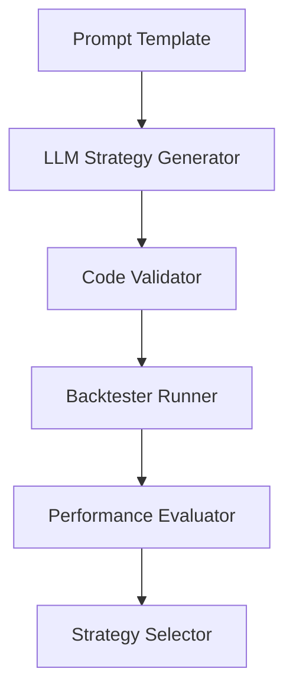

# 🧠 AI Strategy Discovery Engine

A modular, GPT-powered platform for generating, backtesting, and selecting algorithmic trading strategies — built for experimentation, competition, and future research (FYP 2026 @ MMU 🎓).

---

## 📌 Project Summary

This system automates the discovery of trading strategies using large language models (LLMs) like OpenAI GPT.  
It combines strategy generation, backtesting, evaluation, and filtering into one pipeline.

Originally inspired by the IMC Prosperity Trading Challenge, this project aims to evolve into a full-featured research platform suitable for Final Year Project (FYP) and academic presentation.

---

## 📐 System Architecture



**Modules**:
- 📄 **Prompt Loader**: loads prompt templates for strategy generation  
- 🤖 **Strategy Generator**: uses GPT to create Python-based trading strategies  
- 🧪 **Validator**: ensures generated code is syntactically valid  
- 📉 **Backtester**: runs simulations using the IMC tutorial market engine  
- 📊 **Evaluator**: scores each strategy on PnL, risk, stability  
- 🔍 **Selector**: filters top-performing strategies for tuning

---

## 🚀 Quick Start

> ⚠️ Note: You must provide your own OpenAI API key in `config.py`.

```bash
git clone https://github.com/yourname/strategy-factory.git
cd strategy-factory

# Install dependencies
pip install -r requirements.txt

# Run the pipeline
python run_pipeline.py
```

> You can modify prompt templates in the `/prompts/` folder.

---

## 💻 Tech Stack

- Python 3.10+
- OpenAI GPT-3.5 / GPT-4 (via API)
- Custom backtest system (IMC prosperity3bt)
- CLI + logging based workflow
- Optional: Streamlit for future visualization

---

## 🔄 Roadmap

- [x] Basic strategy generation pipeline (v1)  
- [ ] Add API key management & failover  
- [ ] Integrate strategy scoring model  
- [ ] Batch strategy generation mode  
- [ ] Streamlit-based result viewer  
- [ ] Combine with Genetic Optimizer (WIP)

---

## 🎓 Academic Context

This project is part of an early-stage Final Year Project initiative  
at **Multimedia University (MMU)**, under the **Bachelor of Computer Science (Hons.) in AI** program.  
Planned FYP Start: **March/April 2026 (Year 2, Semester 3)**  
Supervisor: *Dr. Ong Lee Yeng*

---

## 🤝 Contributions & Feedback

If you're interested in collaboration, mentoring, or feedback — feel free to open an issue or connect.

---

## 📄 License

This project is open for academic and research purposes only.  
**Commercial use is not permitted without consent.**
